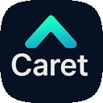

[Read this document in English](./README.md)

# 캐럿: 당신의 AI 개발 파트너


Caret은 개발자와 AI 에이전트가 함께 성장하며 소프트웨어를 만들어나가는 차세대 개발 환경을 목표로 하는 VS Code 확장 프로그램입니다. AI와의 긴밀한 협력을 통해 개발 생산성을 높이고, 복잡한 문제를 해결하는 데 도움을 드립니다. ｡•ᴗ•｡💕

> **Note:** 이 프로젝트는 [Cline](https://github.com/cline/cline) 프로젝트의 포크 버전입니다. 원본 프로젝트의 훌륭한 기반 위에, AI 에이전트와의 더욱 깊은 상호작용과 지능적인 개발 지원 기능을 탐구하고 있습니다. 🌿

## 주요 목표 및 특징

**왜 Caret인가요?** 기존 AI 코딩 도구의 "블랙박스"에 답답함을 느끼셨나요? AI 에이전트를 내 방식대로 제어하고, 원하는 모델을 연결하며, 개발 워크플로우를 진정으로 맞춤화하고 싶으셨나요? Caret은 **개발자와 AI가 신뢰하는 동료로서 함께하는 경험**을 목표로 합니다. AI를 투명하게 이해하고, 자유롭게 확장하며, 최고의 동료처럼 함께 성장하는 환경을 제공합니다.

*   **개발자 주도 AI 오케스트레이션:** 불투명한 내부 로직 대신, **명확한 JSON 규칙(`.caretrules`, 퍼소나)**으로 AI의 행동을 직접 정의하고 제어하세요. AI가 어떻게 작동하는지 이해하고, 내 프로젝트와 스타일에 맞게 길들일 수 있습니다.
*   **워크플로우 맞춤 설정 (4+1 모드):** 정해진 틀을 넘어, **AI의 역할과 상호작용 방식을 직접 설계**하세요. 기본 제공되는 모드(Arch, Dev, Rule, Talk, Empty)를 수정하거나, 완전히 새로운 모드를 만들어 나만의 AI 개발 파트너를 구축할 수 있습니다.
*   **모델 선택의 자유 (로컬 LLM & 프라이버시):** 특정 벤더 종속 없이 **원하는 LLM을 자유롭게 연결**하세요. 상용 API는 물론, **로컬 sLLM을 활용**하여 비용, 보안, 성능 요구사항을 충족하고 **데이터 프라이버시를 확보**할 수 있습니다.
*   **AI와의 실질적 협업:** 단순 코드 생성을 넘어, 프로젝트 **맥락을 이해하고(RAG 목표)**, 개발자와 함께 문제를 해결하는 **지능적인 파트너**를 지향합니다. Caret은 AI의 가능성을 탐구하고 **AI와 효과적으로 협업하는 방법을 배우는 플랫폼**이 될 것입니다.
*   **함께 만드는 오픈소스 (Apache 2.0):** Caret은 AI 시대의 개발 방향을 함께 고민하고 만들어가는 **오픈소스 프로젝트**입니다. 투명하게 공유하고, 자유롭게 기여하며, 함께 발전시켜 나갑시다!

## 왜 Cursor / Windsurf 만으로는 부족할까요?


| SaaS AI IDE 한계 | 실무 개발에서 꼭 통제해야 하는 이유 |
|-----------------|------------------------------------|
| **블랙박스 컨텍스트·모델 버전** | 재현·디버깅·회귀 테스트 불가 |
| **요금제·쿼터 변동** | 예산 예측 실패, 대규모 팀 비용 폭등 |
| **외부 서버에 코드·로그 저장** | 보안·규제(PII, 영업비밀) 위반 가능 |
| **VS Code 의존 엔드포인트 고정** | CLI·CI·다른 IDE와 파이프라인 통합 곤란 |
| **룰·워크플로 커스터마이징 제한** | 팀 코딩 규칙, 도메인 규제 반영 불가 |
| **로컬 sLLM 미지원** | 망 분리·저지연·저비용 환경 구축 불가 |
| **파일 안전성(텍스트 패치)** | 구조 손상·롤백 불가 |

> **Caret** 은 모델·인프라·정책을 *모두 코드로 선언*해 **완전한 통제권**을 제공합니다.

## 지원 모델

Caret은 20여 개 제공자의 150개 이상의 AI 모델을 지원하여, 여러분의 필요에 가장 적합한 도구를 선택할 자유를 제공합니다.

- **Anthropic Claude** (Claude 3.7 Sonnet, Claude 3.5 Sonnet, Claude 3 Opus 등)
- **OpenAI** (GPT-4o, GPT-4.1 등)
- **Google Gemini** (Gemini 2.5, Gemini 2.0 등)
- **Mistral AI** (Mistral Large, Codestral 등)
- **AWS Bedrock** (Amazon Nova, AWS의 Claude 등)
- **Vertex AI** (Google Cloud의 AI 플랫폼)
- 그 외 Ollama 및 LM Studio를 통한 로컬 모델 등 다수

## 시작하기

Caret은 현재 활발히 개발 중이며, 여러분의 관심과 참여로 함께 만들어가는 프로젝트입니다! 꾸준히 발전하는 모습을 지켜봐 주세요! ☕

1.  **코드 저장소:** [aicoding-caret/caret-zero](https://github.com/aicoding-caret/caret-zero) 레파지토리에서 개발 진행 상황을 확인하실 수 있습니다. 코드를 직접 빌드하고 사용해보시려면 이 레파지토리를 Star ⭐ 하고 지켜봐 주세요.
2.  **설치 (향후):** 정식 배포 후에는 VS Code 마켓플레이스에서 "Caret"을 검색하여 설치할 수 있습니다. (준비 중)
3.  **설정 (설치 후):**
    *   제공되는 AI 에이전트 퍼소나를 꾸며보세요.
    *   프로젝트 루트에 `.caretrules` 파일을 생성하여 작업 모드와 규칙을 정의합니다.
    *   ARCH, DEV, RULE, TALK의 4가지 기본 모드와 비어있는 모드 하나를 더하여, 원하시는 작업에 최적화할 수 있습니다.
4.  **참여 및 기여:** 프로젝트에 기여하거나 최신 소식을 받아보시려면 레파지토리를 Star ⭐ 해주시거나 Issue를 통해 의견을 남겨주세요!
5.  **커뮤니티 (준비 중):** 최신 소식과 논의는 [AICoding-Caret Facebook 그룹](https://facebook.com/groups/aicoding-caret)에서 이루어질 예정입니다.
6.  **공식 웹사이트 (향후):** [caret.team](https://caret.team) (준비 중)

## 빌드 및 패키징 🛠️

로컬 개발 환경을 설정하고 확장 프로그램을 빌드하려면 다음 단계를 따르세요.

### 1. 레파지토리 설정

이 프로젝트는 중첩된 서브 레파지토리 구조를 사용합니다. 메인 `caret-zero` 레파지토리를 클론한 후, 그 안에 `cline` 레파지토리를 클론하고, 호환성이 확인된 특정 버전으로 체크아웃해야 합니다.

```bash
# 1. 메인 Caret 레파지토리 클론
git clone https://github.com/aicoding-caret/caret-zero.git
cd caret-zero

# 2. Cline 서브 레파지토리 클론
git clone https://github.com/cline/cline.git

# 3. 테스트된 호환 버전으로 체크아웃
cd cline
git checkout 59a68c8d7adef6afb59990008d66d5bd74d30558
cd ..
```
> **중요:** `cline` 서브 디렉토리는 반드시 위의 특정 커밋 버전에 맞춰져야 빌드가 정상적으로 동작합니다. 다른 버전의 커밋은 호환성 문제를 일으킬 수 있습니다.

### 2. 의존성 설치

프로젝트는 중첩된 구조이므로, 두 곳에서 의존성 설치가 필요합니다:

1. 프로젝트 루트(`caret-zero`)에서 메인 의존성 설치:
```bash
npm install
```

2. webview-ui 디렉토리에서 프론트엔드 의존성 설치:
```bash
cd webview-ui
npm install
```

> **중요**: webview-ui의 의존성 설치를 건너뛰면 빌드 과정에서 TypeScript 타입 정의 오류가 발생할 수 있습니다.

#### Windows 환경 빠른 설정

Windows 사용자를 위한 자동화된 설정 스크립트를 제공합니다:

```powershell
# 프로젝트 루트에서 스크립트 실행
.\scripts\project_first_setting_for_windows.ps1
```

이 스크립트는 다음 작업을 자동으로 수행합니다:
- Cline 서브 레파지토리 클론
- 모든 의존성 설치 (메인 및 webview-ui)
- Windows 전용 protoc 파일 설정
- 설정 과정 검증

### 3. Windows 환경 설정 (조건부)

Windows 환경에서는 `protoc` 빌드 오류가 발생할 수 있습니다. 이는 `cline` 의존성의 현재 버전의 알려진 문제입니다. 이 문제를 해결하려면, 호환되는 빌드 파일을 `cline/proto/` 디렉토리에 복사해야 합니다.

1.  **파일 복사**:
    *   파일 복사: `src/patch/build-proto.js`
    *   폴더 전체 복사: `src/patch/protoc-31.0-win64`
2.  **파일 붙여넣기**:
    *   복사한 파일과 폴더를 `cline/proto/` 디렉토리에 붙여넣어 기존 파일을 덮어씁니다.

> **참고**: 이는 임시 해결책입니다. 향후 `cline` 업스트림 저장소에서 이 문제가 해결되면 이 단계는 더 이상 필요하지 않을 수 있습니다. 현재 버전에서는 Windows에서의 빌드 실패를 방지하기 위해 이 단계가 필수적입니다. 참고로 Copiolot Cursor등 AI에게 이 3번 섹션을 복붙해서 해달라고하면 잘 덮어줍니다.

### 4. 개발 빌드

확장 프로그램의 TypeScript 코드를 컴파일합니다.

```bash
npm run compile
```

### 5. 개발 환경에서 실행

VS Code에서 `F5` 키를 눌러 디버깅 세션을 시작하면, 새로운 `[Extension Development Host]` 창에서 확장 프로그램을 테스트할 수 있습니다.

**Caret 실행 방법:**
*   확장 프로그램이 실행되면 VS Code의 **Primary Sidebar**에 **Caret 아이콘**이 추가됩니다.
*   이 아이콘을 클릭하여 Caret 웹뷰를 열고 사용을 시작할 수 있습니다.

## 기여하기

Caret 프로젝트는 여러분의 기여를 환영합니다! 자세한 내용은 `