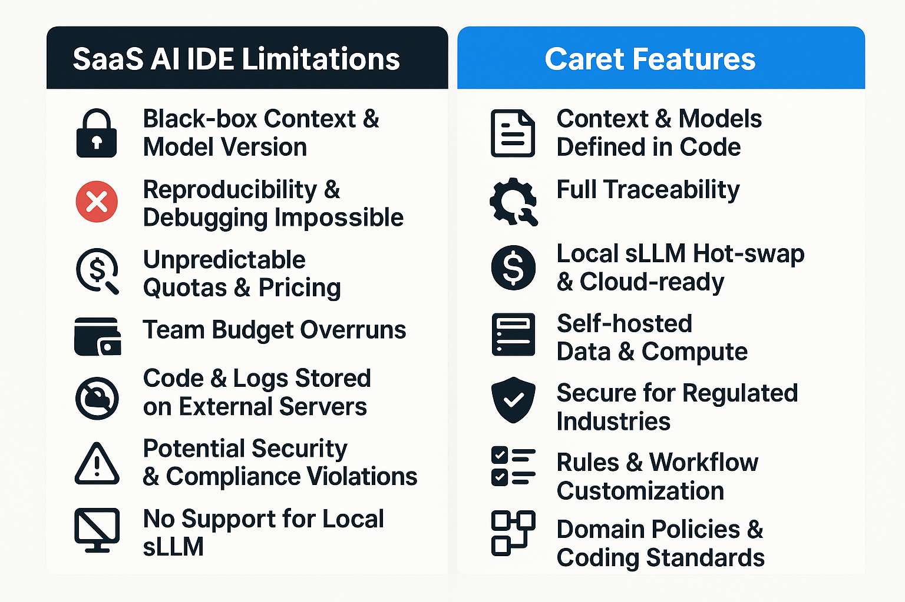

[Read this document in English](./README.md)

# 캐럿 : 당신의 AI개발 파트너


Caret은 개발자와 AI 에이전트가 함께 성장하며 소프트웨어를 만들어나가는 차세대 개발 환경을 목표로 하는 VS Code 확장 프로그램입니다. AI와의 긴밀한 협력을 통해 개발 생산성을 높이고, 복잡한 문제를 해결하는 데 도움을 드립니다. ｡•ᴗ•｡💕

> **Note:** 이 프로젝트는 [Cline](https://github.com/cline/cline) 프로젝트의 포크 버전입니다. 원본 프로젝트의 훌륭한 기반 위에, AI 에이전트와의 더욱 깊은 상호작용과 지능적인 개발 지원 기능을 탐구하고 있습니다. 🌿

## 주요 목표 및 특징

**왜 Caret인가요?** 기존 AI 코딩 도구의 "블랙박스"에 답답함을 느끼셨나요? AI 에이전트를 내 방식대로 제어하고, 원하는 모델을 연결하며, 개발 워크플로우를 진정으로 맞춤화하고 싶으셨나요? Caret은 **개발자와 AI가 신뢰하는 동료로서 함께하는 경험**을 목표로 합니다. AI를 투명하게 이해하고, 자유롭게 확장하며, 최고의 동료처럼 함께 성장하는 환경을 제공합니다.

*   **개발자 주도 AI 오케스트레이션:** 불투명한 내부 로직 대신, **명확한 JSON 규칙(`.caretrules`, 퍼소나)**으로 AI의 행동을 직접 정의하고 제어하세요. AI가 어떻게 작동하는지 이해하고, 내 프로젝트와 스타일에 맞게 길들일 수 있습니다.
*   **워크플로우 맞춤 설정 (4+1 모드):** 정해진 틀을 넘어, **AI의 역할과 상호작용 방식을 직접 설계**하세요. 기본 제공되는 모드(Arch, Dev, Rule, Talk, Empty)를 수정하거나, 완전히 새로운 모드를 만들어 나만의 AI 개발 파트너를 구축할 수 있습니다.
*   **모델 선택의 자유 (로컬 LLM & 프라이버시):** 특정 벤더 종속 없이 **원하는 LLM을 자유롭게 연결**하세요. 상용 API는 물론, **로컬 sLLM을 활용**하여 비용, 보안, 성능 요구사항을 충족하고 **데이터 프라이버시를 확보**할 수 있습니다.
*   **AI와의 실질적 협업:** 단순 코드 생성을 넘어, 프로젝트 **맥락을 이해하고(RAG 목표)**, 개발자와 함께 문제를 해결하는 **지능적인 파트너**를 지향합니다. Caret은 AI의 가능성을 탐구하고 **AI와 효과적으로 협업하는 방법을 배우는 플랫폼**이 될 것입니다.
*   **함께 만드는 오픈소스 (Apache 2.0):** Caret은 AI 시대의 개발 방향을 함께 고민하고 만들어가는 **오픈소스 프로젝트**입니다. 투명하게 공유하고, 자유롭게 기여하며, 함께 발전시켜 나갑시다!

## 왜 Cursor / Windsurf 만으로는 부족할까요?  


| SaaS AI IDE 한계 | 실무 개발에서 꼭 통제해야 하는 이유 |
|-----------------|------------------------------------|     
| **블랙박스 컨텍스트·모델 버전** | 재현·디버깅·회귀 테스트 불가 |
| **요금제·쿼터 변동** | 예산 예측 실패, 대규모 팀 비용 폭등 |
| **외부 서버에 코드·로그 저장** | 보안·규제(PII, 영업비밀) 위반 가능 |
| **VS Code 의존 엔드포인트 고정** | CLI·CI·다른 IDE와 파이프라인 통합 곤란 |
| **룰·워크플로 커스터마이징 제한** | 팀 코딩 규칙, 도메인 규제 반영 불가 |
| **로컬 sLLM 미지원** | 망 분리·저지연·저비용 환경 구축 불가 |
| **파일 안전성(텍스트 패치)** | 구조 손상·롤백 불가 |


> **Caret** 은 모델·인프라·정책을 *모두 코드로 선언*해 **완전한 통제권**을 제공합니다.

## 핵심 기능 (✓ = 구현, 🚧 = 개발 중, 🗓 = 예정)

| 카테고리 | 기능 | 상태 |
|----------|------|------|
| **투명한 룰 엔진** | `.caretrules` JSON으로 AI 동작 정의 → Git 버전 관리 | ✓ |
| **4 + 1 모드** | Architect · Developer · Rule · Talk · (Empty) *즉시 전환* | ✓ |
| **AI 동료 UI** | 에이전트 썸네일·이름·대화색 커스터마이즈 | ✓ |
| **LLM 라우터** | 로컬(Llama 3, Mistral 등) ↔ 클라우드(OpenAI, Gemini) 핫스왑 | 🚧 |
| **CRDT 실시간 협업** | Yjs 기반 동기화, 공유 커서·프레즌스 | 🚧 |
| **Vector RAG + AST 청킹** | 코드 의미 기반 컨텍스트 주입 | 🚧 |
| **AST·검증 기반 안전 수정** | ts-morph, 테스트·lint 자동 실행 | 🗓 |
| **시맨틱 캐싱 / 프롬프트 압축** | 토큰·비용 50–80 % 절감 | 🗓 |


## 지원하는 AI 모델과 제공자

Caret은 다양한 AI 모델과 제공자를 지원하여 여러분의 필요에 가장 적합한 도구를 선택할 수 있는 자유를 제공합니다:

| 제공자 | 모델 | 총 모델 수 |
|--------|------|------------|
| Anthropic | Claude 3.7 Sonnet, Claude 3.5 Sonnet v2, Claude 3.5 Sonnet, Claude 3.5 Haiku, Claude 3 Opus, Claude 3 Haiku | 6 |
| AWS Bedrock | Amazon Nova Pro v1, Amazon Nova Lite v1, Amazon Nova Micro v1, Claude 3.7 Sonnet, Claude 3.5 Sonnet v2, Claude 3.5 Haiku, Claude 3.5 Sonnet, Claude 3 Opus | 8 |
| Gemini | Gemini 2.5 Pro, Gemini 2.5 Pro Preview, Gemini 2.0 Flash, Gemini 1.5 Flash, Gemini 1.5 Flash 8B, Gemini 1.5 Pro, Gemini 1.5 Pro Preview | 7 |
| OpenAI | GPT-4 Turbo, GPT-4 | 2 |
| Vertex AI | Claude 3.7 Sonnet, Claude 3.5 Sonnet v2, Claude 3.5 Sonnet, Claude 3.5 Haiku, Claude 3 Opus, Claude 3 Haiku | 6 |
| Ollama | Llama 2, CodeLlama, Mistral, Mixtral | 4 |
| LM Studio | 로컬 모델 | 1 |
| OpenAI Native | O3, O4 Mini, GPT-4.1, GPT-4.1 Mini, GPT-4.1 Nano, O3 Mini, O1, O1 Preview, O1 Mini, GPT-4O, GPT-4O Mini, ChatGPT-4O Latest, GPT-4.5 Preview | 13 |
| Requesty | Requesty 모델 | 1 |
| Together | Together 모델 | 1 |
| DeepSeek | DeepSeek Chat, DeepSeek Reasoner | 2 |
| Qwen | Qwen 2.5 Coder (32B, 14B, 7B, 3B, 1.5B, 0.5B), Qwen Coder Plus, Qwen Plus, Qwen Turbo, Qwen Max, Qwen VL Max, Qwen VL Plus | 18 |
| Doubao | Doubao 1.5 Pro (256K, 32K), DeepSeek V3, DeepSeek R1 | 4 |
| Mistral | Pixtral Large, Ministral 3B, Ministral 8B, Mistral Small, Pixtral 12B, Open Mistral Nemo, Open Codestral Mamba, Codestral | 8 |
| VSCode LM | VSCode LM 모델 | 1 |
| LiteLLM | LiteLLM 모델 | 1 |
| AskSage | AskSage 모델 | 1 |
| XAI | XAI 모델 | 1 |
| SambaNova | SambaNova 모델 | 1 |
| OpenRouter | OpenRouter 모델 | 1 |

**총계: 20개 제공자, 105개 모델**

각 모델은 다음과 같은 상세 정보로 구성되어 있습니다:
- ID와 이름
- 설명
- 지원 기능 (이미지, 컴퓨터 사용, 프롬프트 캐시)
- 토큰 제한
- 가격 정보

## 시작하기

Caret은 현재 활발히 개발 중이며, 아직 많은 기능이 준비 단계에 있습니다. 여러분의 관심과 참여로 함께 만들어가는 프로젝트입니다! 꾸준히 발전하는 모습을 지켜봐 주세요! ☕

1.  **코드 저장소:** 개발 진행 상황은 [aicoding-caret/caret-zero](https://github.com/aicoding-caret/caret-zero) 레파지토리에서 확인하실 수 있습니다. (현재는 초기 구성 중!) 코드를 직접 빌드하고 사용해보시려면 이 레파지토리를 Star ⭐ 하고 지켜봐 주세요.
2.  **설치 (향후):** 정식 배포 후에는 VS Code 마켓플레이스에서 "Caret"을 검색하여 설치할 수 있습니다. (아직 준비 중!)
3.  **설정 (설치 후):**
    *   제공되는 AI에이전트 퍼소나를 꾸며보세요. 템플릿으로 Pulse9의 사랑이, 이치카 마도베, 시안, 우분투탄 4종이 제공됩니다.
    *   다음은 프로젝트 루트에 `.caretrules` 파일을 생성하여 작업 모드와 규칙을 정의합니다.
    *   AI모델과 시스템프롬프트를 고칠수 있는 4가지 모드 (ARCH, DEV, RULE, TALK)이 기본 제공되며, 이 4가지 모드를 포함하여 총 5가지 모드를 사용할 수 있어, 원하시는 작업들에 최적화 할 수 있습니다.
4.  **참여 및 기여:** 프로젝트에 기여하거나 최신 소식을 받아보시려면 레파지토리를 Star ⭐ 해주시거나 Issue를 통해 의견을 남겨주세요!
5.  **커뮤니티 (준비 중):** 최신 소식과 논의는 [AICoding-Caret Facebook 그룹](https://facebook.com/groups/aicoding-caret)에서도 이루어질 예정입니다. 향후 사용법, 고급 활용 팁 등 **다양한 교육 자료와 교육프로그램**도 커뮤니티를 통해 제공될 계획입니다.
6.  **간편 접속 (향후 계획):** 미래에는 Caret 웹사이트(공식 웹사이트: caret.team 예정)를 통해 계정을 생성하면, 복잡한 개별 LLM API 키 설정 없이도 **Caret의 핵심 기능을 더 쉽게 이용**할 수 있도록 하는 방안을 구상하고 있습니다.

## 향후 로드맵 (간략)

Caret은 지속적으로 발전해 나갈 것입니다. 주요 방향성은 다음과 같습니다. 더 자세한 계획은 [Caret 프로젝트 비전 및 개발 로드맵 문서](./caret-docs/plan/Caret%20프로젝트%20비전%20및%20개발%20로드맵.md)에서 확인하실 수 있습니다.

*   **RAG 고도화:** 프로젝트 컨텍스트 이해 능력 강화 (벡터 DB 연동, 자동 동기화 등)
*   **멀티 에이전트 협업:** 다양한 전문 에이전트(테스터, 문서 작성가 등) 간의 유기적인 협력 기능 구현
*   **Vibe Coding UX 개선:** 개발자와 AI 간의 실시간 상호작용 및 개발 흐름 최적화
*   **LLM 지원 확대:** 더 다양한 로컬/클라우드 모델 연동 옵션 제공 및 최적화
*   **플러그인 시스템 (장기 목표):** 사용자가 직접 Caret의 기능을 확장할 수 있는 구조 마련

여러분의 피드백과 기여는 Caret의 로드맵을 더욱 풍성하게 만들 것입니다!

## 커뮤니티 및 소통 채널 (준비 중)
*   **GitHub Issues:** 버그 리포트, 기능 제안 등 기술적인 논의
*   **Facebook 그룹:** [AICoding-Caret](https://facebook.com/groups/aicoding-caret) (최신 소식, 사용자 간 논의)


## 빌드 및 패키징 🛠️

로컬 개발 환경을 설정하고 확장 프로그램을 빌드하려면 다음 단계를 따르세요.

### 1. 레파지토리 클론

로컬 컴퓨터에 `caret-zero` 레파지토리를 클론합니다.

```bash
git clone https://github.com/aicoding-caret/caret-zero.git
cd caret-zero
```

### 2. 의존성 설치

프로젝트 루트에서 필요한 모든 npm 패키지를 설치합니다. 이 한 번의 명령어로 `cline`과 `webview-ui` 워크스페이스를 포함한 전체 프로젝트의 의존성이 설치됩니다.

```bash
npm install
```

### 3. 개발 빌드

확장 프로그램의 TypeScript 코드를 컴파일합니다. `dist` 폴더에 필요한 JavaScript 파일이 생성됩니다.

```bash
npm run compile
```

### 4. 개발 환경에서 실행

개발 빌드가 완료되면, 테스트 및 디버깅을 위해 새 VS Code 창에서 확장 프로그램을 실행할 수 있습니다.

-   VS Code에서 `F5` 키를 누릅니다.

### 5. 릴리즈 패키지 (.vsix) 생성

공유 가능한 `.vsix` 설치 파일을 만들려면 릴리즈 빌드 스크립트를 실행하세요. 이 스크립트는 버전 관리, 패키징을 처리하고 최종 파일을 `/release` 디렉토리에 저장합니다.

```powershell
# (루트 디렉토리에서)
./build-release.ps1
```
결과 파일명은 `release/caret-vVERSION-DATE.vsix` 형식입니다.

## 기여하기

Caret 프로젝트는 여러분의 기여를 환영합니다! 버그 리포트, 기능 제안, 코드 기여 등 어떤 형태든 좋습니다. 자세한 내용은 `CONTRIBUTING.md`(추가 예정) 파일을 참고해주세요.

## 문서

더 자세한 정보는 [`docs`](./docs/) 디렉토리의 문서를 참고해주세요.

*   [아키텍처 개요](./docs/architecture/extension-architecture.mmd)
*   [신규 개발자 온보딩 가이드](./docs/development/new-developer-onboarding-guide.md)
*   [작업 로그](./docs/work-logs/)
*   ... (다른 중요한 문서 링크 추가)

## 라이선스

[Apache 2.0](./LICENSE) © 2024 [Caretive INC.](https://caretive.ai/)

## 지원 모델

Caret은 200개 다양한 제공자에 걸쳐 150개 이상의 AI 모델을 지원합니다:

- **Anthropic Claude** (Claude 3.7 Sonnet, Claude 3.5 Sonnet, Claude 3 Opus 등)
- **OpenAI** (GPT-4o, GPT-4.1 등)
- **Google Gemini** (Gemini 2.5, Gemini 2.0 등)
- **Mistral AI** (Mistral Large, Codestral 등)
- **AWS Bedrock** (Amazon Nova, AWS의 Claude 등)
- **Vertex AI** (Google Cloud의 AI 플랫폼)
- Ollama 및 LM Studio를 통한 로컬 모델을 포함한 기타 다양한 모델

지원되는 모델의 전체 목록은 [지원 모델 문서](caret-docs/supported-models.ko.md)를 참조하세요.
