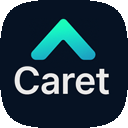
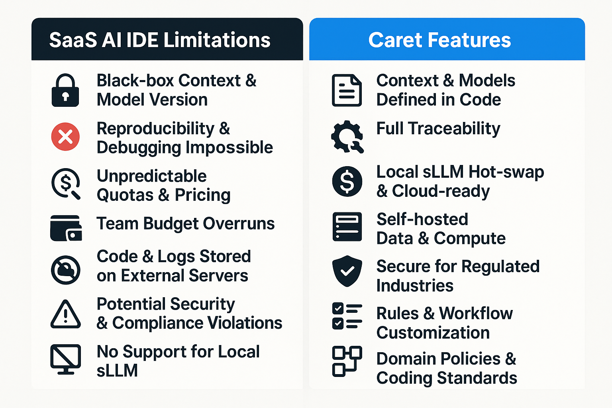

[한국어로 읽기](./README.ko.md)

# Caret: Your AI Development Partner 


Caret is a VS Code extension that aims to create a next-generation development environment where developers and AI agents grow together to build software. Through close collaboration with AI, it helps increase development productivity and solve complex problems. ｡•ᴗ•｡💕

> **Note:** This project is a fork of the [Cline](https://github.com/cline/cline) project. Building on the excellent foundation of the original project, we are exploring deeper interactions with AI agents and intelligent development support features. 🌿

## Key Goals and Features

**Why Caret?** Frustrated with the "black box" of existing AI coding tools? Want to control AI agents your way, connect the models you want, and truly customize your development workflow? Caret aims to provide **an experience where developers and AI work together as trusted colleagues**. Understand AI transparently, extend it freely, and grow together like the best teammates.

* **Developer-Driven AI Orchestration:** Instead of opaque internal logic, define and control AI behavior directly with **clear JSON rules (`.caretrules`, persona)**. Understand how AI works and train it to match your project and style.
* **Customizable Workflow (4+1 Modes):** Beyond fixed templates, **design AI roles and interaction methods yourself**. Modify the provided modes (Arch, Dev, Rule, Talk, Empty) or create entirely new ones to build your own AI development partner.
* **Freedom of Model Choice (Local LLM & Privacy):** **Connect any LLM freely** without vendor lock-in. Meet cost, security, and performance requirements while **ensuring data privacy** by utilizing commercial APIs or **local sLLMs**.
* **Practical AI Collaboration:** Beyond simple code generation, aim for an **intelligent partner** that **understands project context (RAG goal)** and solves problems together with developers. Caret will be a platform for exploring AI possibilities and **learning how to collaborate effectively with AI**.
* **Open Source Together (Apache 2.0):** Caret is an **open source project** where we think about and create the future of development in the AI era together. Let's share transparently, contribute freely, and grow together!

## Why Aren't Cursor / Windsurf Enough?


| SaaS AI IDE Limitations | Why Control is Critical in Production Development |
|------------------------|--------------------------------------------------|
| **Black Box Context & Model Versions** | Cannot reproduce, debug, or regression test |
| **Plan & Quota Changes** | Budget prediction failure, cost explosion for large teams |
| **Code & Logs on External Servers** | Potential security & regulation (PII, trade secrets) violations |
| **Fixed VS Code Dependent Endpoints** | Difficult to integrate with CLI, CI, other IDEs |
| **Limited Rules & Workflow Customization** | Cannot enforce team coding rules, domain regulations |
| **No Local sLLM Support** | Cannot build air-gapped, low-latency, low-cost environments |
| **File Safety (Text Patches)** | Structure damage, no rollback possible |

> **Caret** provides *complete control* by declaring models, infrastructure, and policies **all as code**.

## Supported Models

Caret provides support for over 150 AI models across 20 different providers including:

- **Anthropic Claude** (Claude 3.7 Sonnet, Claude 3.5 Sonnet, Claude 3 Opus, etc.)
- **OpenAI** (GPT-4o, GPT-4.1, etc.)
- **Google Gemini** (Gemini 2.5, Gemini 2.0, etc.)
- **Mistral AI** (Mistral Large, Codestral, etc.)
- **AWS Bedrock** (Amazon Nova, Claude on AWS, etc.)
- **Vertex AI** (Google Cloud's AI platform)
- And many others including local models via Ollama and LM Studio

## Getting Started

Caret is actively under development, with many features still in preparation. It's a project we're building together with your interest and participation! Keep watching as we steadily progress! ☕

1. **Code Repository:** Check development progress at [aicoding-caret/caret-zero](https://github.com/aicoding-caret/caret-zero) repository. Star ⭐ and watch the repository if you want to build and use the code directly.
2. **Installation (Future):** Once officially released, you can install "Caret" from the VS Code marketplace. (Coming soon!)
3. **Setup (After Installation):**
   * Customize the provided AI agent personas.
   * Create a `.caretrules` file in your project root to define work modes and rules.
   * Four modes (ARCH, DEV, RULE, TALK) plus an empty mode are provided to optimize for your desired tasks.
4. **Participation & Contribution:** Star ⭐ the repository or leave feedback through Issues to contribute or receive updates!
5. **Community (Coming Soon):** Latest news and discussions will be available in the [AICoding-Caret Facebook group](https://facebook.com/groups/aicoding-caret).
6. **Official Website (Future):** [caret.team](https://caret.team) (coming soon!)

## Build & Packaging 🛠️

Follow these steps to set up your local development environment and build the extension.

### 1. Repository Setup

This project uses a nested sub-repository structure. First, clone the main `caret-zero` repository, and then clone the `cline` repository inside it.

```bash
# 1. Clone the main repository
git clone https://github.com/aicoding-caret/caret-zero.git

# 2. Change into the new directory
cd caret-zero

# 3. Clone the sub-repository
git clone https://github.com/cline/cline.git
```
> **Important:** The `cline` folder must be located directly inside the `caret-zero` folder for the build to work correctly.

### 2. Install Dependencies

From the project root (`caret-zero`), install all necessary npm packages.

```bash
npm install
```

### 3. Windows Environment Setup (Conditional)

If you are on a Windows machine, you may encounter `protoc` build errors. This is a known issue with the current version of the `cline` dependency. To fix this, you need to copy the compatible build files into the `cline` subdirectory.

1.  **Copy Files**:
    *   Copy the file: `docs/development/resources/build-proto.js`
    *   Copy the entire folder: `docs/development/resources/protoc-31.0-win64`
2.  **Paste Files**:
    *   Paste the copied file and folder into the `cline/proto/` directory, overwriting any existing files.

> **Note**: This is a temporary workaround. This step may no longer be necessary if the issue is resolved in a future version of the `cline` upstream repository. This step is crucial for preventing build failures on Windows with the current version.

### 4. Build Proto Schemas

Caret uses protocol buffers for communication between components. Generate the necessary TypeScript and JavaScript files from the `.proto` definitions.

```bash
npm run build-proto
```

### 5. Development Build

Compile the TypeScript code for the extension.

```bash
npm run compile
```

### 6. Run for Development

Press `F5` in VS Code to run the extension in a new `[Extension Development Host]` window for testing and debugging.

## Contributing

The Caret project welcomes your contributions! Please refer to the `CONTRIBUTING.md` file for details.

## Documentation

For more detailed information, please refer to the documents in the [`docs`](./docs/) directory.

* [Architecture Overview](./docs/architecture/extension-architecture.mmd)
* [New Developer Onboarding Guide (Korean)](./docs/development/new-developer-onboarding-guide.md)
* [Upstream Merging Guide (Korean)](./docs/development/cline-merging-guide.md)

## License

[Apache 2.0](./LICENSE) © 2024 [Caretive INC.](https://caretive.ai/) 
