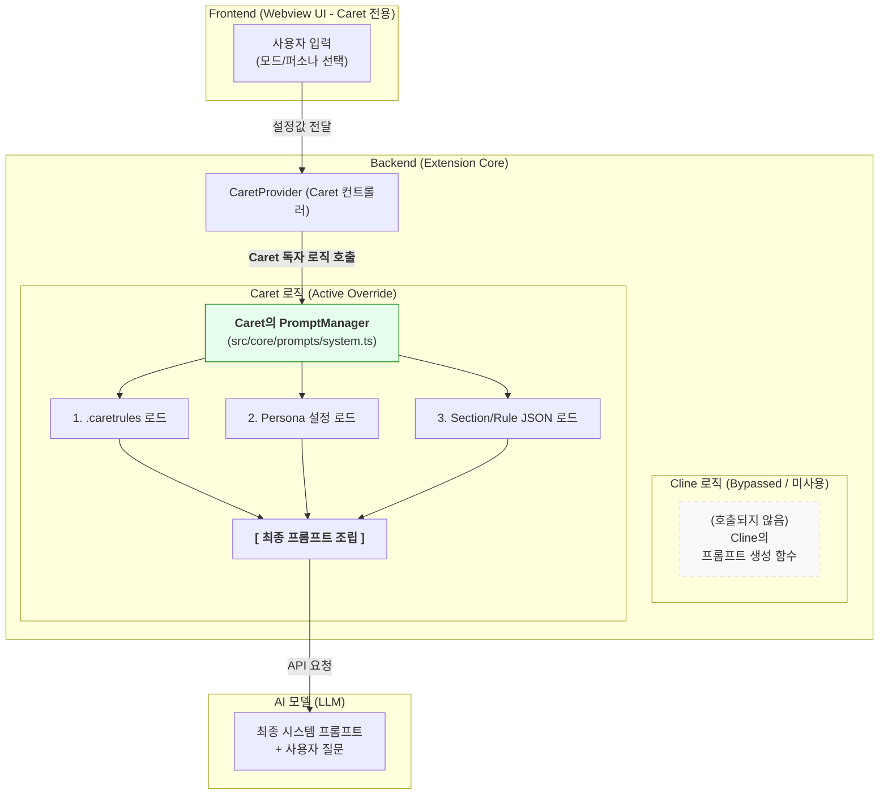

# 아키텍처: 시스템 프롬프트 교체(Override) 전략

**작성자**: Alpha
**문서 목적**: `Caret`의 프론트엔드와 백엔드가 어떻게 `cline`의 시스템 프롬프트 기능을 **완전히 교체(Override)** 하고, 독자적인 아키텍처를 구축했는지 상세히 설명합니다.

---

## 1. 핵심 전략: 수정(Modify)이 아닌 교체(Full Override)

`Caret`은 `cline`의 기존 프롬프트 코드를 일부 수정하는 방식이 아니라, 관련 기능을 전혀 호출하지 않고 **`Caret`만의 새로운 시스템으로 완전히 대체**하는 방식을 사용합니다.

-   **Frontend**: `Caret`은 `cline`의 UI 컴포넌트를 사용하는 대신, `SettingsView.tsx`, `PersonaSettingsView.tsx` 등 **React 기반의 완전히 새로운 UI를 구축**했습니다. 이 UI는 프롬프트 생성 로직에 관여하지 않습니다.
-   **Backend**: 프론트엔드에서 사용자 입력을 받은 `CaretProvider` (컨트롤러)는 `cline`의 프롬프트 생성 함수를 호출하는 대신, **`Caret`이 자체적으로 구현한 `PromptManager`(`src/core/prompts/system.ts`)를 호출**합니다.

이것이 바로 `Caret`의 핵심적인 오버라이드 구조입니다. `cline`의 기능은 그대로 둔 채, 진입점(Entrypoint)에서 호출 대상을 `Caret`의 모듈로 변경하여 제어권을 가져온 것입니다.

---

## 2. 아키텍처 다이어그램: 제어 흐름의 교체

아래 다이어그램은 `Caret`의 백엔드가 어떻게 `cline`의 로직을 우회하여 독자적인 프롬프트 생성 모듈을 사용하는지 보여줍니다.

---

## 3. 컴포넌트별 역할 상세

### 3.1. 프론트엔드 (Caret 전용 UI)

-   **역할**: "단순 설정값 전달자"
-   **세부사항**:
    -   `Caret`의 프론트엔드는 `cline`과 무관하게 React로 새롭게 개발되었습니다.
    -   사용자가 모드나 퍼소나를 선택하면, UI는 **프롬프트 내용 자체를 만들지 않고**, 단지 `modeId`나 `personaId` 같은 식별자만 백엔드로 전송합니다.
    -   즉, **`cline`의 프론트엔드 코드는 이 과정에서 전혀 사용되지 않습니다.**

### 3.2. 백엔드 (Caret의 핵심 제어부)

-   **역할**: "총괄 지휘자 및 실제 조립공"
-   **세부사항**:
    1.  **진입점 교체**: `CaretProvider`는 UI로부터 메시지를 받으면, `cline`의 함수가 아닌 **`Caret`의 `PromptManager`를 명시적으로 호출**합니다. 이것이 "교체"의 핵심입니다.
    2.  **독자적인 조립 로직**:
        -   **`PromptManager` (`src/core/prompts/system.ts`)**: 이 파일은 `Caret`에만 존재하며, 시스템 프롬프트 생성을 총괄합니다.
        -   **동적 소스 조합**: `.caretrules` 파일, `persona` 설정, `src/core/prompts/sections/` 와 `src/core/prompts/rules/` 폴더의 수많은 JSON 조각들을 동적으로 읽어와 결합합니다.
    -   결과적으로, **`cline`의 프롬프트 관련 백엔드 코드는 존재는 하지만, 호출되지 않으므로(dead code) 전혀 동작하지 않습니다.**

---

## 4. 결론

-   **`protoc` 문제와의 차이점**: `protoc` 패치는 `cline`의 빌드 스크립트를 **덮어쓰는** 방식이지만, 시스템 프롬프트는 `cline`의 로직을 **호출하지 않고 우회**하는 방식입니다.
-   **독립성과 확장성**: 이 아키텍처 덕분에 `Caret`은 `cline`의 업데이트로부터 프롬프트 기능이 완전히 독립되어 있으며, 매우 유연하고 자유롭게 프롬프트 구조를 확장할 수 있습니다.

이것이 `Caret`이 `cline`을 기반으로 하면서도, 핵심적인 AI 상호작용 방식을 완전히 새롭게 정의할 수 있는 이유입니다. 