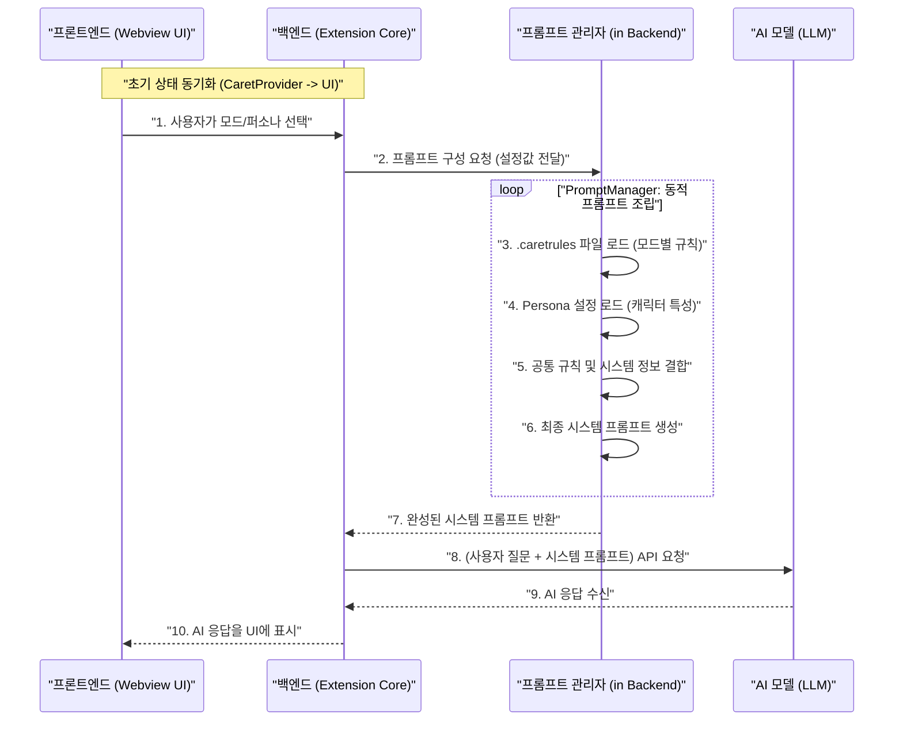

# Caret 시스템 프롬프트 아키텍처: `cline` 오버라이드 전략

**작성자**: Alpha
**문서 목적**: `Caret`이 어떻게 `cline`의 기존 프롬프트 시스템을 사용하지 않고, 완전히 독립적이고 유연한 자체 시스템 프롬프트 생성 아키텍처를 구축했는지 상세히 설명합니다.

---

## 1. 핵심 사상: 제어권의 완전한 이전

`Caret`의 가장 중요한 아키텍처 결정 중 하나는 **시스템 프롬프트 생성의 제어권을 `cline`으로부터 완전히 가져와 독자적인 시스템을 구축**한 것입니다.

-   **`cline`의 한계 (추정)**: `cline`의 프롬프트 시스템은 기능에 따라 고정된 프롬프트를 사용하거나, 제한적인 조합만 가능했을 것입니다. 이는 다양한 모델과 복잡한 작업 시나리오에 대응하기 어렵고, 사용자가 커스터마이징하기도 힘든 구조입니다.

-   **`Caret`의 접근 방식**: `Caret`은 이러한 한계를 극복하기 위해, **여러 종류의 규칙과 설정 파일(JSON)을 실시간으로 조합**하여 현재 작업 맥락에 최적화된 시스템 프롬프트를 동적으로 생성하는 방식을 채택했습니다. 이는 `cline`의 코드를 전혀 수정하지 않고, `Caret`의 백엔드에서 모든 것을 처리하는 **완전한 오버라이드(Full Override)** 전략입니다.

---

## 2. 프롬프트 생성 흐름도

사용자의 간단한 선택이 어떤 과정을 거쳐 최종 시스템 프롬프트로 완성되는지 보여주는 다이어그램입니다.

---

## 3. 아키텍처 구성 요소 및 역할

시스템 프롬프트를 만드는 과정은 프론트엔드와 백엔드의 명확한 역할 분담을 통해 이루어집니다.

### 3.1. 프론트엔드 (Webview UI) - "설정값 전달자"

-   **역할**: UI는 단지 사용자가 선택한 **설정값(ID)을 백엔드로 전달**하는 역할만 수행하며, 프롬프트의 실제 내용에 대해서는 전혀 알지 못합니다.
-   **핵심 컴포넌트**:
    -   `ModeSelector`: 사용자가 'DEV', 'ARCH' 등의 작업 모드를 선택.
    -   `PersonaSettingsView.tsx`: 사용자가 'Alpha', 'Sarang' 등의 AI 퍼소나를 선택.
-   **동작**: 사용자가 모드나 퍼소나를 변경하면, `vscode.postMessage()`를 통해 해당 설정값(`{ type: 'updateMode', payload: 'DEV' }`)을 백엔드로 보냅니다.

### 3.2. 백엔드 (Extension Core) - "총괄 지휘자 및 조립공"

-   **역할**: 백엔드는 프론트엔드로부터 받은 설정값을 바탕으로, `Caret`의 독자적인 프롬프트 생성 로직을 실행하여 최종 시스템 프롬프트를 완성하는 **모든 핵심 역할을 수행**합니다.
-   **핵심 컴포넌트 및 로직**:
    1.  **`CaretProvider` / 컨트롤러**: 프론트엔드로부터 메시지를 수신하고, 현재 선택된 모드와 퍼소나 설정을 상태로 관리합니다.
    2.  **`PromptManager` (`src/core/prompts/system.ts`)**: 시스템 프롬프트 생성을 총괄하는 핵심 모듈입니다.
        -   **프롬프트 조각(Sections) 로드**: `src/core/prompts/sections/` 디렉토리에서 `TOOL_DEFINITIONS.json`, `SYSTEM_INFORMATION.json` 등 프롬프트의 각 부분을 구성하는 JSON 파일들을 읽어옵니다.
        -   **규칙(Rules) 로드**: `.caretrules` 파일(사용자 정의 규칙)과 `src/core/prompts/rules/` 디렉토리의 공통 규칙(`common_rules.json` 등)을 모두 읽어옵니다.
        -   **퍼소나(Persona) 결합**: `PersonaManager`를 통해 선택된 퍼소나의 지시사항(`instructions`)을 가져옵니다.
        -   **동적 조립**: 위에서 읽어온 모든 조각(섹션, 규칙, 퍼소나, 시스템 정보)들을 정해진 순서에 따라 하나의 거대한 문자열로 결합하여 최종 시스템 프롬프트를 완성합니다.

---

## 4. 결론: 왜 이 방식이 강력한가?

-   **완전한 독립성**: `cline`의 프롬프트 관련 코드가 어떻게 변경되든 `Caret`은 전혀 영향을 받지 않습니다.
-   **극대화된 유연성**: 사용자는 `.caretrules` 파일 수정만으로 AI의 행동 규칙과 프롬프트를 손쉽게 변경할 수 있으며, 개발자는 `sections` 와 `rules` 폴더에 JSON 파일을 추가하는 것만으로 시스템 프롬프트의 구조를 쉽게 확장할 수 있습니다.
-   **명확한 관심사 분리**: 프론트엔드는 UI 표시에만, 백엔드는 핵심 로직 처리에만 집중하여 코드의 유지보수성과 확장성을 크게 향상시켰습니다.

이처럼 `Caret`은 `cline`을 기반으로 하되, 핵심적인 프롬프트 시스템은 완전히 새롭게 설계하여 더욱 강력하고 유연한 AI 개발 파트너를 지향합니다. 