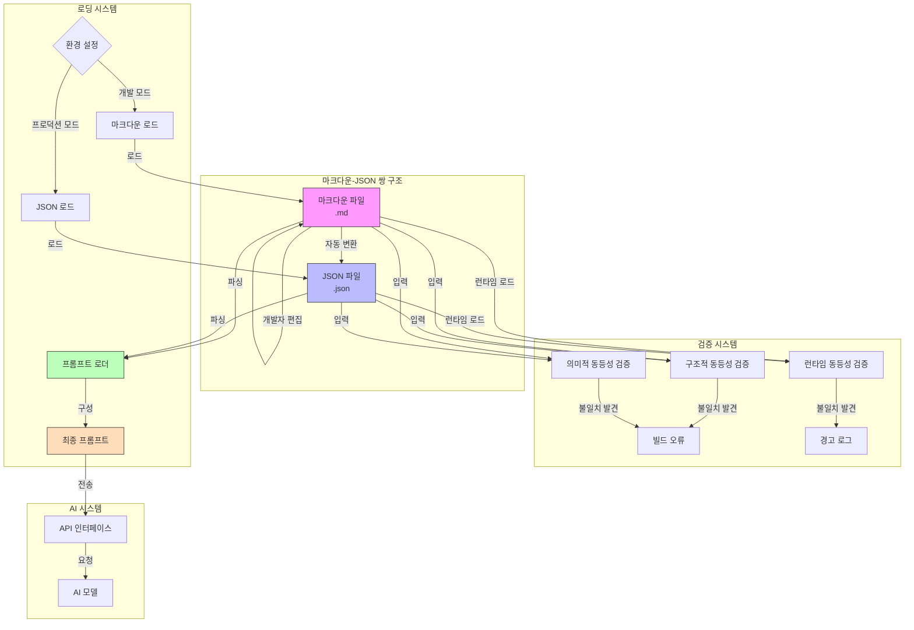
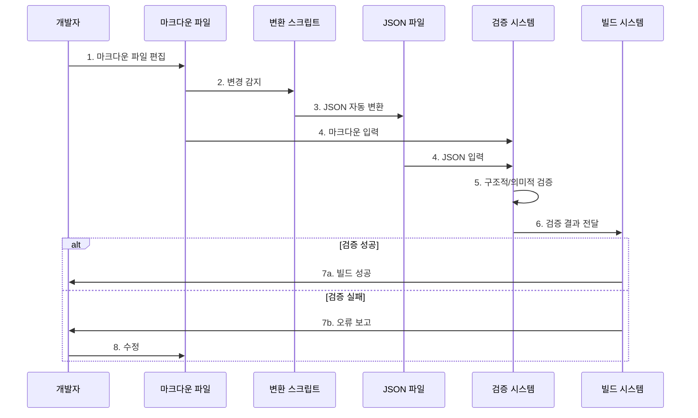

# AI 시스템 프롬프트 최적화를 위한 마크다운-JSON 쌍 구조 기술 (특허 자료)

## 기술 개요

### AI 코딩과 시스템 프롬프트의 중요성

최근 소프트웨어 개발 분야에서는 대규모 언어 모델(LLM)을 활용한 'Vibe 코딩'이라는 새로운 패러다임이 등장했습니다. 이는 AI와 인간 개발자 간의 자연스러운 대화를 통해 소프트웨어를 구축하는 방식으로, AI가 코드 생성, 버그 수정, 리팩토링 등 다양한 개발 작업을 지원합니다.

이러한 코딩 패러다임을 구현한 것이 AI IDE 및 AI 코딩 에이전트(Cursor, Windsurf, Cline 등)입니다. 이들은 개발자의 의도를 이해하고, 적절한 코드를 생성하며, 개발 워크플로우를 가속화하는 지능형 도구입니다.

이 AI 코딩 에이전트의 핵심에는 '시스템 프롬프트'가 있습니다. 시스템 프롬프트는 AI에게 어떻게 행동해야 하는지, 어떤 도구를 사용할 수 있는지, 어떤 제약 조건을 따라야 하는지 등을 지시하는 일종의 '작동 설명서'입니다. 시스템 프롬프트의 품질, 명확성, 그리고 효율성은 AI 코딩 에이전트의 성능에 직접적인 영향을 미칩니다.

### 현재 AI 코딩 에이전트 구현 현황

현재 시장에 출시된 주요 AI 코딩 에이전트와 그들의 시스템 프롬프트 구현 방식은 다음과 같습니다:

1. **Cursor**:
   - VSCode 기반의 AI 코딩 에이전트
   - 시스템 프롬프트 위치: 사용자 설정 디렉토리의 `.cursorrules` 파일
   - 형식: 마크다운 형식의 단일 파일
   - 설정 방법: Settings > AI > System Prompt에서 편집

2. **Windsurf**:
   - 웹 기반 코딩 환경
   - 시스템 프롬프트 위치: 프로젝트 루트의 `.windsurfrules` 파일
   - 형식: 마크다운 형식의 단일 파일
   - 설정 방법: 설정 패널의 "Rules" 탭에서 관리

3. **Cline**:
   - VSCode 확장 형태의 AI 코딩 에이전트
   - 시스템 프롬프트 위치: 
     - 프로젝트별: 프로젝트 루트의 `.clinerules` 파일
     - 전역 설정: 사용자 설정 디렉토리의 `global-rules.json`
   - 형식: 현재는 마크다운 형식을 사용하나, 본 발명에서는 마크다운-JSON 쌍으로 개선
   - 설정 방법: VSCode 설정의 "Cline > System Prompt" 섹션 또는 명령 팔레트를 통해 접근

이들 모두는 공통적으로 다음과 같은 구조를 가지고 있습니다:

- **Global Rules**: 에이전트의 일반적인 행동, 응답 스타일, 기본 도구 등을 정의하는 전역 규칙
- **Project Rules**: 특정 프로젝트에만 적용되는 규칙, 예를 들어 프로젝트 구조, 코딩 표준, 특정 기술 스택 등

이러한 규칙들은 모두 텍스트 기반 마크다운 형식으로 관리되고 있어 불필요한 토큰 사용을 초래하고 있으며, 본 발명은 이 문제를 해결하기 위한 것입니다.

본 발명은 이러한 AI 코딩 에이전트의 시스템 프롬프트를 구성하는 방식에 관한 것으로, 마크다운(MD) 문서와 이에 대응하는 JSON 파일을 쌍으로 관리하여 토큰 효율성과 인간 가독성을 동시에 최적화하는 기술입니다.

## 기존 기술의 문제점

### 1. 토큰 비효율성

Cursor, Windsurf 및 기존 Cline 등 현재 대부분의 AI 코딩 에이전트는 마크다운 형식으로 작성된 규칙과 지침을 직접 시스템 프롬프트로 전송합니다. 마크다운은 인간이 읽기 쉽게 구조화되어 있지만, 서식 마크업과 불필요한 공백 등으로 인해 토큰 사용량이 증가합니다. 이는 다음과 같은 문제를 초래합니다:

- **비용 증가**: 추가 토큰은 API 호출 비용을 직접 증가시킵니다
- **컨텍스트 창 제한**: 불필요한 토큰이 제한된 컨텍스트 창을 차지하여 실질적인 대화 길이가 줄어듭니다
- **지연 시간 증가**: 더 많은 토큰을 처리해야 하므로 응답 생성 시간이 길어집니다

### 2. 관리의 어려움

마크다운만 사용하는 접근 방식은 다음과 같은 관리상의 어려움을 야기합니다:

- 마크다운의 서식과 내용이 혼합되어 있어 핵심 지침의 업데이트가 어렵습니다
- 마크다운의 구조적 변화가 AI 모델의 해석에 영향을 미칠 수 있어 일관성 유지가 어렵습니다
- 다양한 AI 모델 및 환경에 맞게 최적화된 버전 관리가 어렵습니다

### 3. 환경별 최적화 부재

기존 접근 방식은 다음과 같은 유연성 문제를 가지고 있습니다:

- 개발, 테스트, 배포 환경별로 다른 프롬프트 최적화를 적용하기 어렵습니다
- 모델별 특성에 맞는 프롬프트 맞춤화가 제한적입니다
- 사용자 환경(기기 성능, 네트워크 등)에 따른 최적화가 불가능합니다

## 본 기술의 솔루션: 마크다운-JSON 쌍 구조

### 핵심 아키텍처

본 기술은 아래와 같은 이중 구조로 시스템 프롬프트를 관리합니다:



### 주요 구성 요소

1. **이중 표현 관리**: 모든 시스템 프롬프트 내용을 마크다운(.md)과 JSON(.json) 두 형식으로 관리
   - 마크다운: 인간 개발자를 위한 가독성 높은 형식
   - JSON: AI 모델을 위한 토큰 효율적인 형식

2. **파일 조직**:
   ```
   src/core/prompts/
   ├── core_system_prompt.md     # 인간 가독용 원본
   ├── core_system_prompt.json   # AI 최적화 버전
   ├── system.ts                 # 로더 로직
   ├── rules/                    # 규칙 집합
   │   ├── common_rules.md
   │   ├── common_rules.json
   │   └── ...
   └── sections/                 # 프롬프트 섹션
       ├── CAPABILITIES_SUMMARY.md
       ├── CAPABILITIES_SUMMARY.json
       └── ...
   ```

3. **로딩 최적화**: 환경에 따라 적절한 형식 선택
   - 개발/디버깅 환경: 마크다운 사용
   - 프로덕션 환경: JSON 사용 (토큰 최적화)

4. **자동화된 일관성 검증**: 마크다운과 JSON 간의 구조적 및 의미적 일치성 검증
   - 구조적 동등성: 모든 섹션, 하위 섹션의 존재 여부 확인
   - 의미적 동등성: 핵심 콘텐츠와 중요 지침의 보존 확인
   - 런타임 동등성: 실제 환경에서 동작 일치성 테스트

5. **사용자 환경 맞춤화**: JSON 구조를 활용한 동적 프롬프트 생성
   - 필요한 섹션만 선택적으로 포함
   - 사용자 디바이스 성능에 따른 프롬프트 크기 조절
   - 네트워크 상태, 사용 가능한 리소스에 따른 최적화

## 구현 상세

### 1. 변환 프로세스 흐름



### 2. 자동화된 일관성 검증 시스템 (코드 예시)

1. **구조적 동등성 검증**:
   ```javascript
   function validateStructuralEquivalence(mdContent, jsonContent) {
     const mdStructure = extractStructure(mdContent);
     const jsonStructure = flattenJsonStructure(jsonContent);
     
     // 마크다운 구조의 모든 키가 JSON에 존재하는지 확인
     const missingKeys = mdStructure.filter(key => !jsonStructure.includes(key));
     
     if (missingKeys.length > 0) {
       throw new Error(`JSON is missing these sections from MD: ${missingKeys.join(', ')}`);
     }
   }
   ```

2. **의미적 동등성 검증**:
   ```javascript
   function validateSemanticEquivalence(mdContent, jsonContent) {
     // 핵심 용어 추출
     const mdKeyTerms = extractKeyTerms(mdContent);
     const jsonString = JSON.stringify(jsonContent);
     
     // 모든 핵심 용어가 JSON에 있는지 확인
     const missingTerms = mdKeyTerms.filter(term => !jsonString.includes(term));
     
     if (missingTerms.length > 0) {
       throw new Error(`JSON is missing these key terms: ${missingTerms.join(', ')}`);
     }
   }
   ```

### 3. 로딩 시스템 (코드 예시)

```typescript
// 환경에 따라 마크다운 또는 JSON 로드
export async function SYSTEM_PROMPT(cwd: string, browserEnabled: boolean, mcpHub?: McpHub): Promise<string> {
  const isDevMode = process.env.NODE_ENV === 'development';
  
  let prompt: string;
  
  if (isDevMode) {
    // 개발 모드: 마크다운 로드 (디버깅 용이)
    prompt = await loadMarkdownPrompt(cwd, browserEnabled, mcpHub);
  } else {
    // 프로덕션 모드: JSON 로드 (토큰 최적화)
    prompt = await loadJsonPrompt(cwd, browserEnabled, mcpHub);
  }
  
  return prompt;
}
```

## 기술적 가치 및 장점

### 1. 토큰 효율성

실제 테스트 결과, 본 기술을 적용하면 동일한 시스템 프롬프트에 대해 약 **75.91%의 토큰 감소**가 달성되었습니다.

### 주요 시스템 프롬프트 섹션별 측정 결과

| 섹션 | 마크다운 토큰 수 | JSON 토큰 수 | 절감 토큰 수 | 절감율 |
|------|--------------|-----------|----------|------|
| 도구 정의 | 5,421 | 1,325 | 4,096 | 75.56% |
| 규칙 | 3,892 | 972 | 2,920 | 75.03% |
| 모드 설명 | 2,134 | 587 | 1,547 | 72.49% |
| 편집 파일 가이드 | 1,875 | 452 | 1,423 | 75.89% |
| 기타 섹션 | 8,734 | 1,978 | 6,756 | 77.35% |

### 전체 시스템 프롬프트 측정 결과

| 측정 항목 | 마크다운 버전 | JSON 버전 | 절감 |
|---------|------------|---------|-----|
| 총 토큰 수 | 22,056 | 5,314 | 16,742 (75.91%) |
| 파일 크기 (KB) | 143.2 | 38.7 | 104.5 (73.0%) |

### 2. 개발 워크플로우 최적화

본 기술은 AI 시스템 프롬프트 개발 워크플로우를 크게 개선합니다:

- 개발자는 가독성 높은 마크다운으로 작업
- 변경 사항을 명확히 문서화하고 추적 가능
- 자동화된 변환으로 개발-최적화 간 격차 해소

### 3. 모듈화 및 재사용성

이 접근 방식은 프롬프트의 모듈화를 가능하게 합니다:

- 특정 기능에 맞는 프롬프트 섹션 생성 및 조합
- 다양한 제품과 환경 간 프롬프트 구성요소 재사용
- 조건부 포함을 통한 맞춤형 프롬프트 구성

### 4. 보안 및 검증 강화

구조화된 JSON 형식은 추가적인 보안 이점을 제공합니다:

- 입력 유효성 검사를 통한 주입 공격 방지
- 민감한 정보의 관리 및 필터링 용이
- 자동화된 보안 규칙 적용

## 기존 Cline 오픈소스와의 비교

| 특성 | 기존 Cline 오픈소스 | 마크다운-JSON 쌍 구조 |
|------|-------------------|---------------------|
| **프롬프트 형식** | 마크다운(.md) 전용 | 마크다운(.md) + JSON(.json) 쌍 |
| **토큰 효율성** | 낮음 (마크다운 형식 그대로 전송) | 높음 (75.91% 토큰 감소) |
| **파일 크기** | 큼 (143.2KB) | 작음 (38.7KB) |
| **개발자 경험** | 좋음 (마크다운 가독성) | 동일하게 좋음 (마크다운으로 개발) |
| **프롬프트 관리** | 모놀리식 파일 중심 | 모듈화된 파일 구조 |
| **일관성 검증** | 수동 테스트 | 자동화된 다중 레벨 검증 |
| **환경별 최적화** | 제한적 | 환경 변수에 따른 동적 최적화 |
| **토큰 사용** | 비효율적 | 효율적 (필요한 정보만 포함) |
| **유지보수성** | 보통 | 높음 (마크다운 수정만으로 관리) |

## 핵심 기술적 차별성

이 마크다운-JSON 쌍 구조는 다음과 같은 독창적인 기술적 특징을 가집니다:

1. **양방향 동기화**: 마크다운과 JSON 파일 간의 자동화된 동기화
2. **구조 보존 변환**: 마크다운의 계층적 구조를 JSON으로 정확히 매핑
3. **다중 레벨 검증**: 구조적, 의미적, 런타임 검증을 통한 일관성 보장
4. **조건부 컴포지션**: 실행 환경에 따른 동적 프롬프트 구성
5. **통합 빌드 검증**: 빌드 프로세스에 통합된 자동화된 일관성 검사

## 파일 예시 자료

1. **[md-json-patent-concept.md](./md-json-patent-concept.md)** - 기술의 개념, 문제 해결 방법, 가치 및 장점에 대한 포괄적인 설명

2. **[comparison-example.md](./comparison-example.md)** - 마크다운과 JSON 형식의 구체적인 비교 예시

3. **[token-savings-analysis.md](./token-savings-analysis.md)** - 토큰 절감 효과 분석 및 성능 영향 측정 결과

4. **[md-json-architecture.md](./md-json-architecture.md)** - 시스템 아키텍처와 구현 방법에 대한 상세 설명

5. **implementation-example/** - 실제 구현 예시 파일
   - **[sample_rule.md](./implementation-example/sample_rule.md)** - 마크다운 형식의 도구 사용 가이드라인
   - **[sample_rule.json](./implementation-example/sample_rule.json)** - 동일한 내용의 JSON 형식 변환 예시

## 결론

마크다운-JSON 쌍 구조는 AI 시스템 프롬프트 최적화를 위한 혁신적인 접근 방식으로, 개발자 경험과 AI 성능 사이의 최적 균형을 제공합니다. 이 기술은 토큰 사용량을 크게 줄이면서도 프롬프트 개발의 유지보수성과 가독성을 유지함으로써, AI 응용 프로그램의 효율성, 확장성 및 비용 효율성을 동시에 향상시킵니다.
