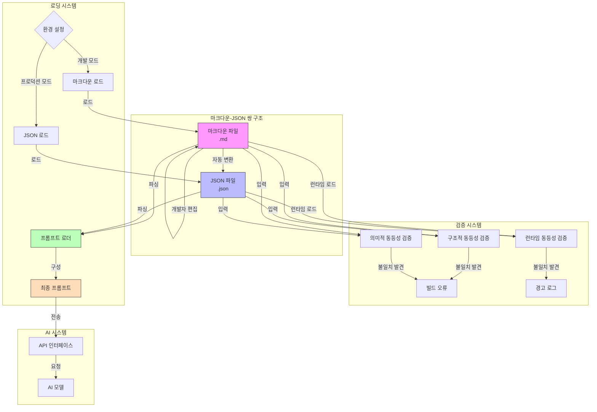
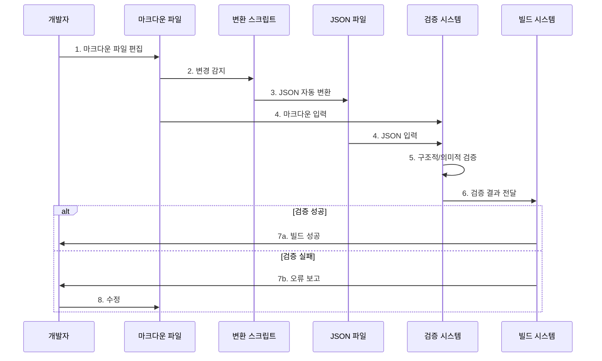

# 마크다운-JSON 쌍 구조의 아키텍처 및 구현 방법

## 개요

이 문서는 Cline이 개발한 마크다운-JSON 쌍 구조의 구체적인 아키텍처와 구현 방법에 대해 설명합니다. 이 접근 방식은 시스템 프롬프트의 관리와 효율성을 동시에 최적화하는 독창적인 방법을 제시합니다.

## 시스템 아키텍처



## 구현 상세

### 1. 파일 구조 및 조직

시스템 프롬프트는 다음과 같이 모듈화된 파일로 조직됩니다:

```
src/core/prompts/
├── core_system_prompt.md     # 인간 가독용 원본
├── core_system_prompt.json   # AI 최적화 버전
├── system.ts                 # 로더 로직
├── rules/                    # 규칙 집합
│   ├── common_rules.md
│   ├── common_rules.json
│   ├── act_mode_rules.md
│   ├── act_mode_rules.json
│   ├── plan_mode_rules.md
│   └── plan_mode_rules.json
└── sections/                 # 프롬프트 섹션
    ├── CAPABILITIES_SUMMARY.md
    ├── CAPABILITIES_SUMMARY.json
    ├── EDITING_FILES_GUIDE.md
    ├── EDITING_FILES_GUIDE.json
    ├── TOOLS_HEADER.md
    ├── TOOLS_HEADER.json
    └── ...
```

각 프롬프트 파일은 `.md`와 `.json` 형식으로 쌍을 이루어 유지됩니다.

### 2. 변환 프로세스 흐름



1. **개발자 워크플로우**: 개발자는 가독성이 높은 마크다운 파일만 직접 편집합니다.
2. **자동 변환**: 마크다운 파일이 변경되면, 변환 스크립트가 자동으로 JSON 파일을 생성/업데이트합니다.
3. **검증 단계**: 마크다운과 JSON 파일의 구조적/의미적 동등성이 검증됩니다.
4. **빌드 통합**: 검증은 빌드 프로세스에 통합되어 일관성을 보장합니다.

### 3. 자동화된 일관성 검증 시스템

마크다운-JSON 쌍의 일관성을 보장하기 위해 세 가지 수준의 검증이 구현되었습니다:

1. **구조적 동등성 검증**:
   - 마크다운 파일에 있는 모든 섹션과 하위 섹션이 JSON에 존재하는지 확인
   - 중첩 구조가 올바르게 변환되었는지 검증
   - 헤더 레벨과 JSON 객체 계층 구조의 일치성 확인

```javascript
// scripts/md-json-equivalence-test.js (일부)
function validateStructuralEquivalence(mdContent, jsonContent) {
  const mdStructure = extractStructure(mdContent);
  const jsonStructure = flattenJsonStructure(jsonContent);
  
  // 마크다운 구조의 모든 키가 JSON에 존재하는지 확인
  const missingKeys = mdStructure.filter(key => !jsonStructure.includes(key));
  
  if (missingKeys.length > 0) {
    throw new Error(`JSON is missing these sections from MD: ${missingKeys.join(', ')}`);
  }
  
  // 추가 구조적 검증...
}
```

2. **의미적 동등성 검증**:
   - 마크다운의 핵심 콘텐츠가 JSON에서 손실되지 않았는지 검증
   - 코드 예제, 중요 지침, 핵심 메시지가 보존되었는지 확인
   - 토큰화 후 핵심 용어의 존재 여부 비교

```javascript
// scripts/md-json-equivalence-test.js (일부)
function validateSemanticEquivalence(mdContent, jsonContent) {
  // 핵심 용어 추출
  const mdKeyTerms = extractKeyTerms(mdContent);
  const jsonString = JSON.stringify(jsonContent);
  
  // 모든 핵심 용어가 JSON에 있는지 확인
  const missingTerms = mdKeyTerms.filter(term => !jsonString.includes(term));
  
  if (missingTerms.length > 0) {
    throw new Error(`JSON is missing these key terms: ${missingTerms.join(', ')}`);
  }
  
  // 추가 의미적 검증...
}
```

3. **런타임 동등성 검증**:
   - 실제 환경에서 마크다운과 JSON 기반 프롬프트의 동작 일치성 확인
   - 동일한 입력에 대해 두 형식이 AI 모델에서 동일한 출력을 생성하는지 테스트
   - 회귀 테스트 스위트를 통한 자동화된 검증

```javascript
// scripts/runtime-equivalence-test.js (일부)
async function testRuntimeEquivalence() {
  const testCases = loadTestCases();
  const mdPrompt = loadMdPrompt();
  const jsonPrompt = loadJsonPrompt();
  
  for (const testCase of testCases) {
    const mdResult = await runModel(mdPrompt, testCase.input);
    const jsonResult = await runModel(jsonPrompt, testCase.input);
    
    const similarity = calculateSimilarity(mdResult, jsonResult);
    if (similarity < SIMILARITY_THRESHOLD) {
      console.warn(`Runtime divergence detected for test case: ${testCase.name}`);
      // 로그 및 분석...
    }
  }
}
```

### 4. 로딩 시스템

실행 환경에 따라 적절한 프롬프트 형식을 로드하는 메커니즘:

```typescript
// src/core/prompts/system.ts

import fs from 'fs';
import path from 'path';
import * as core_system_prompt_json from './core_system_prompt.json';

// 환경에 따라 마크다운 또는 JSON 로드
export async function SYSTEM_PROMPT(cwd: string, browserEnabled: boolean, mcpHub?: McpHub): Promise<string> {
  const isDevMode = process.env.NODE_ENV === 'development';
  
  let prompt: string;
  
  if (isDevMode) {
    // 개발 모드: 마크다운 로드 (디버깅 용이)
    prompt = await loadMarkdownPrompt(cwd, browserEnabled, mcpHub);
  } else {
    // 프로덕션 모드: JSON 로드 (토큰 최적화)
    prompt = await loadJsonPrompt(cwd, browserEnabled, mcpHub);
  }
  
  return prompt;
}

// 마크다운 프롬프트 로드 함수
async function loadMarkdownPrompt(cwd: string, browserEnabled: boolean, mcpHub?: McpHub): Promise<string> {
  const corePath = path.join(__dirname, 'core_system_prompt.md');
  let corePrompt = fs.readFileSync(corePath, 'utf8');
  
  // 규칙 및 섹션 로드...
  // 조건부 포함...
  
  return corePrompt;
}

// JSON 프롬프트 로드 함수
async function loadJsonPrompt(cwd: string, browserEnabled: boolean, mcpHub?: McpHub): Promise<string> {
  let jsonPrompt = core_system_prompt_json.content;
  
  // 규칙 및 섹션 로드...
  // 조건부 포함...
  
  return jsonPrompt;
}
```

### 5. 주요 최적화 기술

JSON 형식의 토큰 최적화는 다음과 같은 특수 기법을 사용합니다:

1. **중복 제거**: 마크다운 설명은 풍부한 내용을 포함하지만, JSON은 유일한 정보만 보존
2. **구조적 압축**: 계층적 정보를 중첩 객체로 효율적으로 표현
3. **키-값 정규화**: 일관된 키-값 구조를 통해 토큰 사용 일관성 제공
4. **선택적 포함**: 조건에 따라 필요한 섹션만 동적으로 포함

## 실제 효과 측정

Cline 프로젝트에서 측정한 실제 토큰 절감 효과:

### 주요 시스템 프롬프트 섹션별 측정 결과

| 섹션 | 마크다운 토큰 수 | JSON 토큰 수 | 절감 토큰 수 | 절감율 |
|------|--------------|-----------|----------|------|
| 도구 정의 | 5,421 | 1,325 | 4,096 | 75.56% |
| 규칙 | 3,892 | 972 | 2,920 | 75.03% |
| 모드 설명 | 2,134 | 587 | 1,547 | 72.49% |
| 편집 파일 가이드 | 1,875 | 452 | 1,423 | 75.89% |
| 기타 섹션 | 8,734 | 1,978 | 6,756 | 77.35% |

### 전체 시스템 프롬프트 측정 결과

| 측정 항목 | 마크다운 버전 | JSON 버전 | 절감 |
|---------|------------|---------|-----|
| 총 토큰 수 | 22,056 | 5,314 | 16,742 (75.91%) |
| 파일 크기 (KB) | 143.2 | 38.7 | 104.5 (73.0%) |

이 측정은 GPT-4 토크나이저를 사용하여 실시되었으며, Claude 모델에서도 유사한 절감 효과가 관찰되었습니다.

## 핵심 기술적 차별성

이 마크다운-JSON 쌍 구조는 다음과 같은 독창적인 기술적 특징을 가집니다:

1. **양방향 동기화**: 마크다운과 JSON 파일 간의 자동화된 동기화
2. **구조 보존 변환**: 마크다운의 계층적 구조를 JSON으로 정확히 매핑
3. **다중 레벨 검증**: 구조적, 의미적, 런타임 검증을 통한 일관성 보장
4. **조건부 컴포지션**: 실행 환경에 따른 동적 프롬프트 구성
5. **통합 빌드 검증**: 빌드 프로세스에 통합된 자동화된 일관성 검사

이러한 기술적 특성의 조합은 이 접근 방식을 단순한 형식 변환 이상의 고유한 시스템으로 만듭니다.
